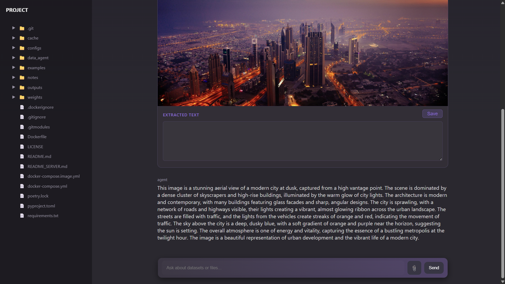
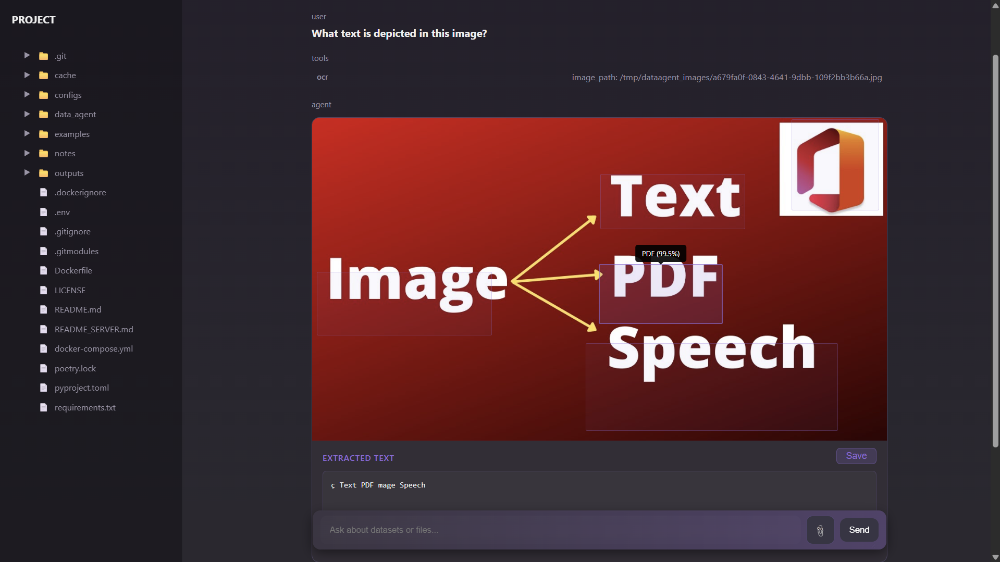
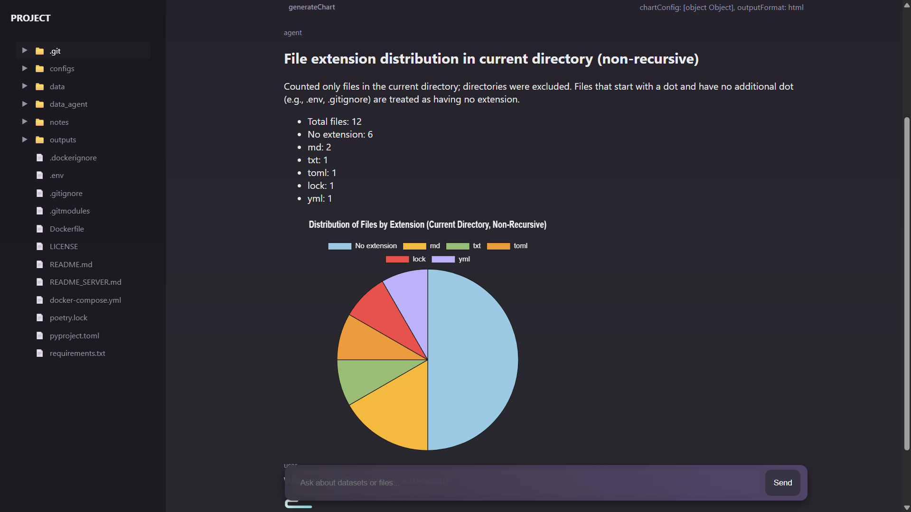
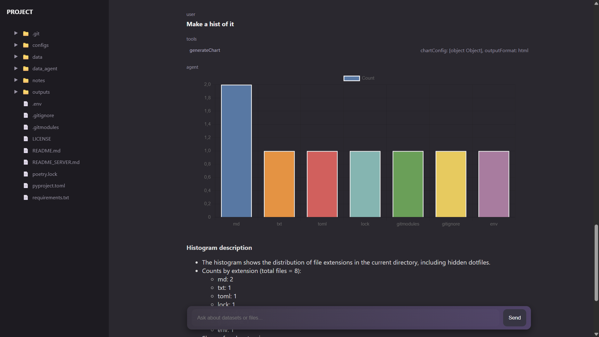
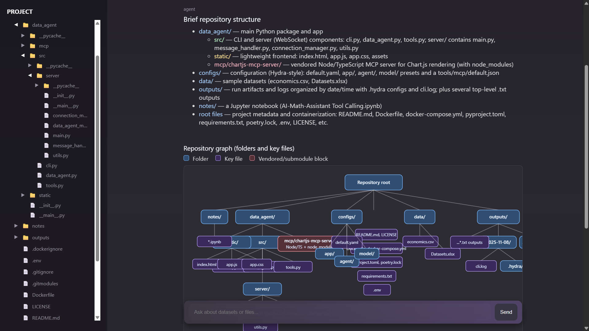

# DataAgent

[](https://www.python.org/)
[](https://python-poetry.org/)
[](LICENSE.txt)

Beautiful, interactive agent for exploring and visualizing images, files and data in a repository. The agent can answer questions about the filesystem, produce charts and render them in a small web UI, and call read-only tools to inspect files.

## Version 0.2.0
- Now multimodal inference is supported.
- vLLM and HuggingFace local inference.
- Custom PaddleOCR tool for OCR visualizing.
- Added button for image uploading.
- Extended configuration.
- Chart.js is temporally unavailable.
---

## Features

- FastAPI-based web UI for interactive conversations with an agent.
- Agent capable of returning HTML snippets (charts, tables), which are sanitized and rendered client-side.
- Extensible toolset: read files, list directories, and produce visualizations.
- Hydra configuration system (configs are in `./configs`), allowing different model and agent configs.

---

## Examples

- Query: "Describe the data folder. What information do they have?"


      The question is about the tables from 'data' folder in the demo filesystem. It describes the content and draws some visuals.

      Currently the chart tool is disabled.

- Query: "Describe this image"



      The agent remembers images and can operate several
      images in a single query.

- Query: "What text is depicted in this image?"



      The result of OCR tool is the interactive image card. 
      You can copy separate words or download full text.

- Query: "Draw a piechart on the number of files with each extension"



      The entire dialogue with the charts are stored in its memory, so you can ask about the chart, as example: "What are the files with no extension?".
      Or you can change the type of diagram.



- Query: "Describe briefly the structure of this repository. Visualize it as a graph"



---

## Quick access

- Homepage: `http://localhost:8080` (default when running locally)
- Entry point: run `python -m data_agent` (the project is Poetry-managed)
- Provider's API key is stored to `.env` or inside the environment. Default provider is OpenRouter, env var: `OPENROUTER_API_KEY` (defined in `./configs`). 
- ⚠️ If the container is silent after it started, it is ok. The server is loading.

---

## Installation

There are three ways to run the project:

### 1) Docker Compose (build from source)

1. Clone this repository
    ```
    git clone --recurse-submodules https://github.com/KIrillPal/DataAgent.git
    cd DataAgent
    ```

2. If API-based inference is needed, put OPENROUTER_API_KEY into .env 

   ```sh
   echo OPENROUTER_API_KEY=sk-proj-... > .env # Do not paste full API key inside echo. Use text editor instead.
   ```

3. Build and run with Docker Compose:

   ```sh
   docker compose up --build
   ```

   The app will be available at `http://localhost:8080` by default (see `configs/app/default.yaml`).

Notes ⚠️:

- The `./configs` folder is mounted into the container so you can edit configs on the host and the container will pick them up.
- Make sure the env var used by your selected model config is present in `.env` (e.g., `OPENROUTER_API_KEY`).
- This builds the image locally, which may take longer but ensures you have the latest code.

### 2) Docker Compose (pre-built image from DockerHub)

1. Clone this repository (or just ensure you have the `configs` directory)
    ```
    git clone https://github.com/KIrillPal/DataAgent.git
    cd DataAgent
    ```

2. If API-based inference is needed, put OPENROUTER_API_KEY into .env 

   ```sh
   echo OPENROUTER_API_KEY=sk-proj-... > .env # Do not paste full API key inside echo. Use text editor instead.
   ```

3. Run with Docker Compose using the pre-built image:

   ```sh
   docker compose -f docker-compose.hub.yml up
   ```

   This will pull the image `kirillpal/data_agent:v0.2.0` from DockerHub instead of building from source.

   The app will be available at `http://localhost:8080` by default (see `configs/app/default.yaml`).

Notes ⚠️:

- The `./configs` folder is mounted into the container so you can edit configs on the host and the container will pick them up.
- Make sure the env var used by your selected model config is present in `.env` (e.g., `OPENROUTER_API_KEY`).
- This uses a pre-built image, which is faster to start but uses the code from the published image version.

### 3) Manual (for development)

0. This repo uses Poetry for dependency management. Ensure you have Poetry installed.
   ```sh
   pip install --upgrade pip && pip install poetry
   ```

1. Create a virtual environment and install dependencies via Poetry:

   ```sh
   git clone --recurse-submodules https://github.com/KIrillPal/DataAgent.git
   cd DataAgent
   poetry install
   ```

2. If API-based inference is needed, put OPENROUTER_API_KEY into .env

   ```sh
   echo OPENROUTER_API_KEY=sk-proj-... > .env # Do not paste full API key inside echo. Use text editor instead.
   ```

3. Run the app (Hydra will load configs from `./configs`):
    
   ```sh
   # default config runs the server (configs/default.yaml)
   python -m data_agent
   ```

   You can specify the config path using hydra arguments:

   ```sh
   python3 -m data_agent --config-dir=./configs --config-name=default
   ```

Environment variables

- Place API keys in the environment or in a `.env` file loaded by the app. The model config `configs/model/gpt-5.yaml` uses `api_env_var: OPENROUTER_API_KEY` (see `configs/model/gpt-5.yaml`).

---

## Configuration

Configs are managed via Hydra and live in `./configs`. The default configuration chain is defined in `configs/default.yaml` and selects a model (by default `gpt-5.yaml`), an agent config and app settings.

Common config paths:

- `configs/model/*.yaml` — model-specific settings and `api_env_var` key names.
- `configs/agent/*.yaml` — agent settings: prompt, limitations.
- `configs/app/*.yaml` — server configuration: host/port, etc.

To change config at runtime you can pass Hydra overrides. Example (run server with a different port and device):

```sh
python -m data_agent app.port=9000 app.inference.device=cpu
```

---

## Local inference

The source of inference is defined by model configuration.
There are 3 types of local providers:

Provider name  | GPU | CPU | Description
------------- | ------------- | ------------- | -------------
vllm  | ✅ | ❌ | Fast and highly configurable GPU inference
huggingface  | ✅ | ✅ | Basic inference for only text-to-text models. vLLM is better choice for GPU.
local  | ✅ | ✅ | Switch between vllm and huggingface depending on the app.inference.device.

Example of the vLLM model config `vllm-smolvlm2-instruct.yaml`:
```yaml
defaults:
- vllm: default.yaml # vLLM server parameters (port, etc)
- _self_

provider: vllm
model: HuggingFaceTB/SmolVLM2-2.2B-Instruct
api_env_var: null

parameters: # Model inference parameters
  temperature: 0.3
  max_tokens: 1024 # Max input tokens

vllm: # vLLM inference parameters
  parameters:
    max_model_len: 2048
    max_num_seqs: 1
  tool_call_parser: pythonic
```

To use this model, the inference device must be cuda.

It is an example of `app/default.yaml` config:
```yaml
port: 8080
host: 0.0.0.0
run_server: true
file_root: .
postgres: null

image: # Image loading parameters
  min_file_size: 1024          # 1 KB minimum
  max_file_size: 20971520      # 20 MB maximum

inference:
  device: cuda                  # Device for inference: 'cpu' or 'cuda'.
  cache: ./cache
```

⚠️ To use CPU inference set "device: cpu" and use model with provider `huggingface` or `local`.

It should also be noted that the server is fully started locally after initializing the models. It may take a few minutes.

### Loading weights

Weights for the model are loaded using HuggingFace API for all local providers.


You can set cache directory for HuggingFace and PaddleOCR to load custom weights via environment variables:

#### Docker compose

   Inside `docker-compose.yml` provide:
   ```yaml
   services:
   data_agent:
      ...
      environment:
            - HF_HOME=/app/weights/huggingface 
            - PADDLE_PDX_CACHE_HOME=/app/weights/ocr
   ```

   ⚠️ Paths are inside the container

#### Module running

   Paste inside `.env`:
   ```
   HF_HOME=./weights/huggingface
   PADDLE_PDX_CACHE_HOME=./weights/ocr
   ```

Then weights will be loaded from this caches and will be downloaded if not found.

---

## Model size configuration

To configure model size use `./configs/default.yml` where you can specify the model config.

As example, you can change:
```yaml
defaults:
  - model: vllm-smolvlm2-2b-instruct.yaml 
     # --> vllm-smolvlm2-256m-instruct.yaml
  - agent: react-vlm.yaml
  - app: default.yaml
```
To make a new configuration set field `model` inside your `./configs/model/<your_model>.yaml`.

## OCR Tool

To find text in image Paddle OCR visualization tool is implemented.

It is also configured in `./configs/agent/tools`. 

⚠️ Therefore, in this implementation OCR is only availiable for **models supporting tool calling**. 

SmolVLM does not support tools. Therefore you should use another VLM model like QwenVL. But SmolVLM still is capable for VQA with multiple images.


## File structure

Top-level project layout:

```
./
├─ 📁 configs/                    # Hydra configuration tree (models, app, agent)
├─ 📁 data_agent/                 # Package source
│  ├─ 📁 src/
│  │  ├─ 📁 server/               # FastAPI app, websocket and message handler
│  │  ├─ 📄 data_agent.py         # Agent implementation and tools
│  │  └─ 📄 cli.py                # Hydra-based CLI and uvicorn launcher
│  ├─ 📁 mcp/                     # MCP Servers for the agent
│  ├─ 📁 static/                  # Static files for the web interface.
├─ 📄 pyproject.toml              # Poetry-managed project file
├─ 📄 poetry.lock                 # Locked dependencies
├─ 📄 Dockerfile                  # Docker file 
├─ 📄 docker-compose.yml          # Compose file (v2.4)
└─ 📄 README.md                   # This document
```

The important runtime entrypoint is `python -m data_agent` which dispatches to the Hydra CLI in `data_agent/src/cli.py`. By default that CLI will start the FastAPI server (see `configs/app/default.yaml`).

---

## Contributing

Contributions welcome. Please open issues or PRs. If adding features that change public behavior, add small tests and update the README with new usage examples.

---

## License

This project uses an MIT-style license (see `LICENSE.txt`).
